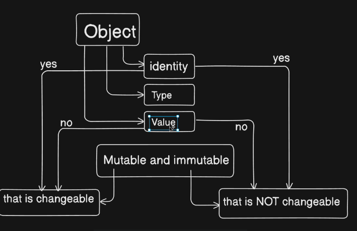
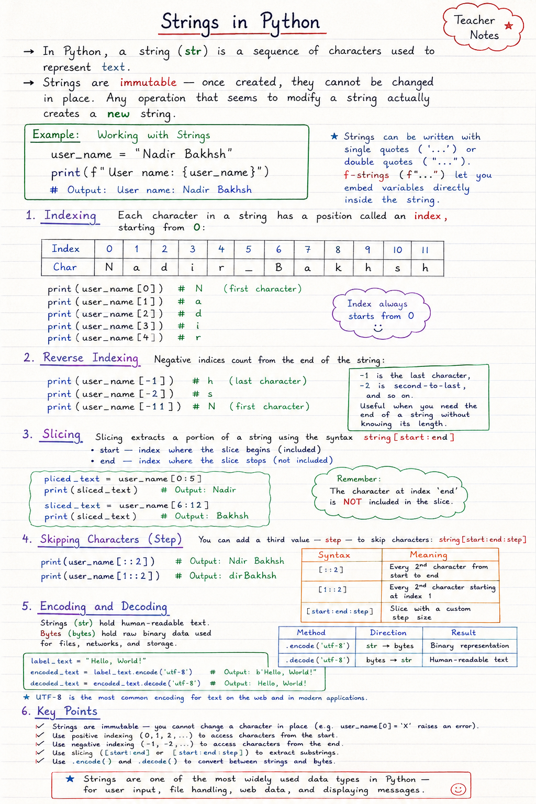

# Objects - Mutable and Immutable in Python

## 1. What is an Object?

In Python, almost everything is an object.
An object has a **value**, a **type**, and an **identity** (memory location).

> **Key point:** We can check the identity of an object using the `id()` function.

---

## 2. Immutable Objects

Immutable objects **cannot** be changed after they are created.
Any operation that seems to change the value actually creates a **new object**.

**Examples:** `int`, `float`, `complex`, `bool`, `str`, `tuple`, `frozenset`, `bytes`

```python
a = 10
b = a
print(id(a))  # suppose 1001
a = a + 5     # creates new object
print(id(a))  # suppose 2002
print(id(b))  # 1001 (unchanged)
```

> Here, a new object is created when the value changes.

---

## 3. Mutable Objects

Mutable objects **can** be changed after they are created.
The changes are made to the **same object** (same identity).

**Examples:** `list`, `dict`, `set`, `bytearray`

```python
l = [10, 20, 30]
print(id(l))  # suppose 3001
l.append(40)  # modifies the same object
print(id(l))  # 3001 (same)
```


> Here, the object is modified in place. Identity remains the same.

---

## 4. Summary

| Immutable | Mutable |
|-----------|---------|
| Cannot be changed after creation | Can be changed after creation |
| Operations create new object | Operations modify the same object |
| Examples: `int`, `str`, `tuple`, etc. | Examples: `list`, `dict`, `set`, etc. |

> **Remember:** Use mutable objects when you need to modify data.
> Use immutable objects when data should not change.



---

## interger


In Python, integers (`int`) are a fundamental data type used to represent whole numbers (positive, negative, or zero) without any decimal point.

### Example: Integer Operations

Let's see how we can work with integers in Python:

```python
# Declare integer variables
black_tea_grams = 100
ginger_grams = 3

# Addition
total_ingredients = black_tea_grams + ginger_grams
print(f"Total ingredients: {total_ingredients} grams")  # Output: 103 grams

# Subtraction
remaining = black_tea_grams - ginger_grams
print(f"Remaining ingredients: {remaining} grams")      # Output: 97 grams

# Basic arithmetic operations
number_a = 10
number_b = 20

sum = number_a + number_b           # Addition: 30
difference = number_a - number_b    # Subtraction: -10
product = number_a * number_b       # Multiplication: 200
quotient = number_a / number_b      # Division: 0.5 (Note: result is float)
remainder = number_a % number_b     # Modulus: 10 (remainder after division)
power = number_a ** number_b        # Exponentiation: 10 to the power of 20

# Print results
print(f"Sum: {sum}")
print(f"Difference: {difference}")
print(f"Product: {product}")
print(f"Quotient: {quotient}")
print(f"Remainder: {remainder}")
print(f"Power: {power}")
```

**Key Points:**
- Integer objects are **immutable** in Python.
- All basic arithmetic operations can be performed using operators like `+`, `-`, `*`, `/`, `%`, and `**`.
- Division (`/`) of two integers returns a float. Use `//` (floor division) if you need an integer result.

```python
print(10 // 3)  # Output: 3
```

Integers are widely used in programs for counting, indexing, and whenever whole numbers are needed.

---


Let's see how we can work with boolean values in Python:

```python
# Declare boolean variables
is_student = True
string_count = 5

print(f"Is student: {is_student}")  # Output: True

# Boolean logic in actions
is_water_boiled = True
add_tea = True

# Logical AND
check_service = is_water_boiled and add_tea
print(f"Check service: {check_service}")  # Output: True

# Logical OR
can_make_tea = is_water_boiled or add_tea
print(f"Can make tea: {can_make_tea}")  # Output: True

# Logical NOT
not_student = not is_student
print(f"Is not student: {not_student}")  # Output: False

# Relational operators return boolean values
print(10 > 3)   # Output: True
print(5 == 8)   # Output: False
```

**Key Points:**
- Python uses `True` and `False` as boolean values.
- Logical operators: `and`, `or`, `not`.
- Booleans are often used in conditions, comparisons, and control flow.
- Result of relational operators (`>`, `<`, `==`, `>=`, `<=`, `!=`) is a boolean value.

Booleans are essential for decision-making and flow control in programming.

---

## Floating Point and Decimal Numbers in Python

In Python, numbers with a fractional part are called *floating point numbers* (or simply *floats*), and numbers with precise decimal representation are handled by the `decimal` module.

### Float Example

```python
milk_quantity = 1.5    # float (liters)
sugar_quantity = 0.75  # float (kg)

total_ingredients = milk_quantity + sugar_quantity
print(f"Total (milk + sugar): {total_ingredients}")  # Output: 2.25
```

Floats can sometimes show small rounding errors because of how they are stored in binary.

```python
a = 0.1
b = 0.2
c = a + b
print(f"0.1 + 0.2 = {c}")  # Output: 0.30000000000000004
```

Notice that `0.1 + 0.2` is not exactly `0.3` due to floating-point arithmetic.

### The `decimal` Module

For more precise decimal arithmetic (such as in financial applications), use Python's `decimal.Decimal`:

```python
from decimal import Decimal

x = Decimal('0.1')
y = Decimal('0.2')
z = x + y
print(f"Using Decimal: 0.1 + 0.2 = {z}")  # Output: 0.3
```

### More Examples

- Regular division always returns a float:
    ```python
    print(7 / 3)   # Output: 2.3333333333333335
    ```
- Floor division with floats rounds down to the nearest whole number, result is a float:
    ```python
    print(7 // 3)  # Output: 2.0
    ```

### Checking Types

```python
print(type(milk_quantity))  # <class 'float'>
print(type(x))              # <class 'decimal.Decimal'>
```

### Key Points
- Use floats (`float`) for general real numbers.
- Use `decimal.Decimal` for precise decimal representation.
- Be aware of possible rounding errors with floats.
- Both support arithmetic operations, but `Decimal` is better for critical accuracy.

Floating point and decimal numbers are foundational in Python for representing any measurement, calculation, or monetary value involving fractions.

---

## Strings in Python

In Python, a **string** (`str`) is a sequence of characters used to represent text. Strings are **immutable** — once created, they cannot be changed in place. Any operation that seems to modify a string actually creates a **new** string.

### Example: Working with Strings

```python
user_name = "Nadir Bakhsh"

print(f"User name: {user_name}")  # Output: User name: Nadir Bakhsh
```

Strings can be written with single quotes (`'...'`) or double quotes (`"..."`). **f-strings** (`f"..."`) let you embed variables directly inside the string.

### Indexing

Each character in a string has a position called an **index**, starting from `0`:

| Index | 0 | 1 | 2 | 3 | 4 | 5 | 6 | 7 | 8 | 9 | 10 | 11 |
|-------|---|---|---|---|---|---|---|---|---|---|----|----|
| Char  | N | a | d | i | r |   | B | a | k | h | s  | h  |

```python
print(user_name[0])  # N  (first character)
print(user_name[1])  # a
print(user_name[2])  # d
print(user_name[3])  # i
print(user_name[4])  # r
```

### Reverse Indexing

Negative indices count from the **end** of the string:

```python
print(user_name[-1])   # h  (last character)
print(user_name[-2])   # s
print(user_name[-11])  # N  (first character)
```

`-1` is the last character, `-2` is second-to-last, and so on. This is useful when you need the end of a string without knowing its length.

### Slicing

**Slicing** extracts a portion of a string using the syntax `string[start:end]`:

- `start` — index where the slice begins (included)
- `end` — index where the slice stops (not included)

```python
sliced_text = user_name[0:5]
print(sliced_text)  # Output: Nadir

sliced_text = user_name[6:12]
print(sliced_text)  # Output: Bakhsh
```

### Skipping Characters (Step)

You can add a third value — **step** — to skip characters: `string[start:end:step]`

```python
print(user_name[::2])   # Output: Ndir Bakhsh  (every 2nd character)
print(user_name[1::2])  # Output: dirBakhsh    (every 2nd character from index 1)
```

| Syntax | Meaning |
|--------|---------|
| `[::2]` | Every 2nd character from start to end |
| `[1::2]` | Every 2nd character starting at index 1 |
| `[start:end:step]` | Slice with a custom step size |

### Encoding and Decoding

Strings (`str`) hold human-readable text. **Bytes** (`bytes`) hold raw binary data used for files, networks, and storage.

```python
label_text = "Hello, World!"

encoded_text = label_text.encode('utf-8')
print(encoded_text)  # Output: b'Hello, World!'

decoded_text = encoded_text.decode('utf-8')
print(decoded_text)  # Output: Hello, World!
```

| Method | Direction | Result |
|--------|-----------|--------|
| `.encode('utf-8')` | str → bytes | Binary representation |
| `.decode('utf-8')` | bytes → str | Human-readable text |

**UTF-8** is the most common encoding for text on the web and in modern applications.

### Key Points

- Strings are **immutable** — you cannot change a character in place (e.g. `user_name[0] = 'X'` raises an error).
- Use **positive indexing** (`0`, `1`, `2`...) to access characters from the start.
- Use **negative indexing** (`-1`, `-2`...) to access characters from the end.
- Use **slicing** (`[start:end]` or `[start:end:step]`) to extract substrings.
- Use **`.encode()`** and **`.decode()`** to convert between strings and bytes.

Strings are one of the most widely used data types in Python — for user input, file handling, web data, and displaying messages.


---

