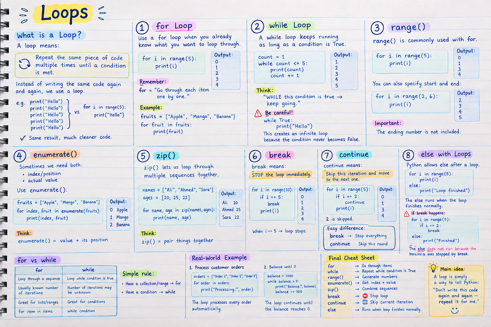

# Loops in Python

## What is a Loop?

A **loop** means: repeat the same piece of code multiple times until a condition is met.

Instead of writing the same code again and again, we use a loop.

```python
print("Hello")
print("Hello")
print("Hello")
print("Hello")
print("Hello")
```

vs

```python
for i in range(5):
    print("Hello")
```

Same result, much cleaner code.

---

## 1. `for` Loop

Use a `for` loop when you already know what you want to loop through.

```python
for i in range(5):
    print(i)
```

**Output:**

```text
0
1
2
3
4
```

> **Remember:** `for` = "Go through each item one by one."

### Example

```python
fruits = ["Apple", "Mango", "Banana"]

for fruit in fruits:
    print(fruit)
```

**Output:**

```text
Apple
Mango
Banana
```

---

## 2. `while` Loop

A `while` loop keeps running as long as a condition is `True`.

```python
count = 1

while count <= 5:
    print(count)
    count += 1
```

**Output:**

```text
1
2
3
4
5
```

> **Think:** "WHILE this condition is true → keep going."

### Be careful

```python
while True:
    print("Hello")
```

This creates an **infinite loop** because the condition never becomes `False`.

---

## 3. `range()`

`range()` is commonly used with `for`.

```python
for i in range(5):
    print(i)
```

**Output:**

```text
0
1
2
3
4
```

You can also specify a start and an end:

```python
for i in range(2, 6):
    print(i)
```

**Output:**

```text
2
3
4
5
```

> **Important:** The ending number is **not** included.

---

## 4. `enumerate()`

Sometimes we need both:

- index / position
- actual value

Use `enumerate()`.

```python
fruits = ["Apple", "Mango", "Banana"]

for index, fruit in enumerate(fruits):
    print(index, fruit)
```

**Output:**

```text
0 Apple
1 Mango
2 Banana
```

> **Think:** `enumerate()` = value + its position.

---

## 5. `zip()`

`zip()` lets us loop through multiple sequences together.

```python
names = ["Ali", "Ahmed", "Sara"]
ages = [20, 25, 22]

for name, age in zip(names, ages):
    print(name, age)
```

**Output:**

```text
Ali 20
Ahmed 25
Sara 22
```

> **Think:** `zip()` = pair things together.

---

## 6. `break`

`break` means: **STOP** the loop immediately.

```python
for i in range(10):
    if i == 5:
        break
    print(i)
```

**Output:**

```text
0
1
2
3
4
```

When `i == 5`, the loop stops.

---

## 7. `continue`

`continue` means: skip this iteration and move to the next one.

```python
for i in range(5):
    if i == 2:
        continue
    print(i)
```

**Output:**

```text
0
1
3
4
```

`2` is skipped.

### Easy difference

| Keyword | What it does |
|---------|----------------|
| `break` | Stop everything |
| `continue` | Skip this round |

---

## 8. `else` with Loops

Python allows `else` after a loop.

```python
for i in range(5):
    print(i)
else:
    print("Loop finished")
```

The `else` runs when the loop finishes **normally**.

### If `break` happens

```python
for i in range(5):
    if i == 2:
        break
else:
    print("Finished")
```

The `else` does **not** run because the loop was stopped by `break`.

---

## `for` vs `while`

| `for` | `while` |
|-------|---------|
| Loop through a sequence | Loop while a condition is true |
| Usually a known number of iterations | Number of iterations may be unknown |
| Great for lists and ranges | Great for conditions |
| `for item in items` | `while condition` |

### Simple rule

- Have a collection or range → use `for`
- Have a condition → use `while`

---

## Real-World Example

### 1. Process customer orders

```python
orders = ["Order 1", "Order 2", "Order 3"]

for order in orders:
    print("Processing:", order)
```

The loop processes every order automatically.

### 2. Balance until 0

```python
balance = 1000

while balance > 0:
    print("Balance:", balance)
    balance -= 100
```

The loop continues until the balance reaches `0`.

---

## Final Cheat Sheet

| Tool | Meaning |
|------|---------|
| `for` | Go through items |
| `while` | Repeat while a condition is `True` |
| `range()` | Generate numbers |
| `enumerate()` | Get index + value |
| `zip()` | Combine sequences |
| `break` | Stop the loop |
| `continue` | Skip the current iteration |
| `else` | Runs when the loop finishes normally |

---

## Main Idea

A loop is simply a way to tell Python:

> "Don't write this code again and again — repeat it for me."


